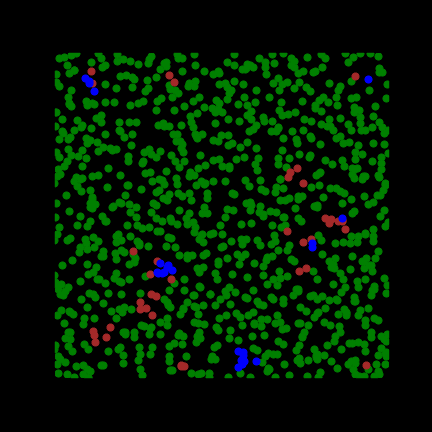

# PPS-app
Rapid-developed an app to calculate and visualize self-structuring particle pattern, in this case recreating a simple motion law for moving and interacting self-propelled particles, as described in article: "How a life-like system emerges from a simplistic particle motion law." by Schmickl, T., Stefanec, M. &amp; Crailsheim, K. in Sci Rep 6, 37969 (2016). https://doi.org/10.1038/srep37969

### Technologies used:

- Python: PyQt5, numpy

### Current state
Basic UI is done, app is not yet showing nor calculating, work in progress. Class which handles calculations is complete.

You can generate the results using testPPS.py

### Example animation

What You see is cell-like structures forming from deterministic law applied to every particle. For more information see article link above.
